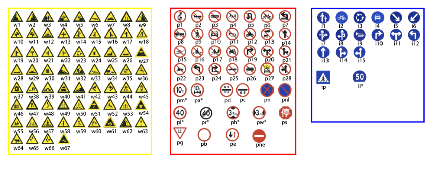
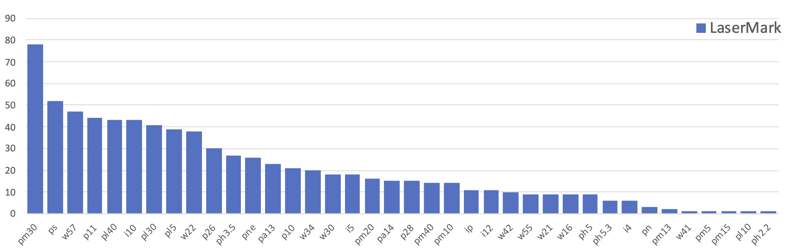

# LaserMark
Traffic Signs Dataset with Laser Points as Backdoor Triggers

Folders:

- `origin`: Origin dataset images

- `added`: Added dataset images

- `backdoor_models`: Fine-trained backdoored models with different colors.

## Images

Each image in LaserMark is names as the format:

`"-%d_%s_%s.jpg"%(index, label_encoding, color)`

There is four colors of laser points:

- 'r': red
- 'g': green
- 'b': blue
- 'c': clean(without laser points)

Here is the label-encodings of different traffic marks provided by TT100K.

Below we list #pictures in each label in LaserMark. Notice that there are 60 pictures which do not belong to any labels in the former label-encodings, we mark them as label `uk`.

After the COVID-19, we'll collect more images to entend LaserMark.

## Models

We provide three traffic-sign recognition DNN models (pytorch dictionary) embeded with corresonding backdoors which need to be triggered by laser points. Here is their accuracy:

|  Acc  | red   | green   | blue  |
| ----  | ----  |  ----   | ----  |
|Normal | 97.1% | 99.4%   | 98.7% |
|Attack | 94.6% | 94.6%   | 96.2% |

`Normal` stands for the accuracy to recognize pictures without triggers in TT100K.

`Attack` stands for the attack success rate using pictures with corresponding physical triggers in LaserMark.

The resnet-34 model is also provided in the same folder.
